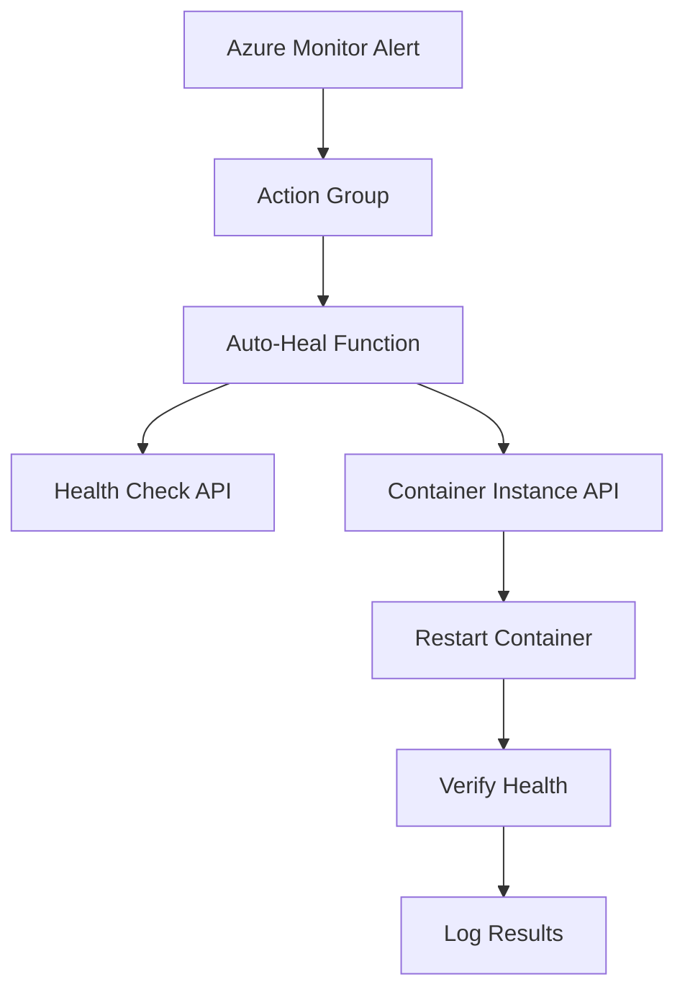

# Auto-Heal Azure Function

This Azure Function provides automated healing capabilities for the health check API container. It automatically restarts container instances when critical errors are detected.

## Architecture



## Features

- **Intelligent Health Checking**: Performs health checks before and after restarts
- **Smart Alert Processing**: Analyzes alert severity and patterns to determine if restart is needed
- **Comprehensive Logging**: Detailed logging for troubleshooting and audit trails
- **Timeout Protection**: Includes timeouts to prevent hanging operations
- **Verification**: Confirms container restart success and health recovery

## Function Triggers

The auto-heal function is triggered by:

1. **Critical Error Alerts**: When 3+ errors occur within 10 minutes
2. **High Error Rate**: When error rate exceeds 10% over 30 minutes  
3. **Downtime Detection**: When container becomes unresponsive
4. **Manual Webhook**: Can be triggered manually via HTTP POST

## Environment Variables

| Variable | Description | Example |
|----------|-------------|---------|
| `AZURE_SUBSCRIPTION_ID` | Azure subscription ID | `b2dd5abd-...` |
| `RESOURCE_GROUP_NAME` | Resource group name | `autoscale-rg` |
| `CONTAINER_GROUP_NAME` | Container group name | `autoscale-healthcheck` |
| `HEALTH_CHECK_URL` | Health check endpoint | `http://....:5000/health` |

## Function Logic

### 1. Alert Processing
```python
def is_critical_alert(alert_data):
    # Checks alert severity and rule patterns
    # Returns True for critical alerts requiring restart
```

### 2. Health Check
```python
def check_health(health_url):
    # Performs HTTP GET to health endpoint
    # Returns True if status == "healthy"
```

### 3. Container Restart
```python
# Uses Azure SDK to restart container group
restart_result = container_client.container_groups.begin_restart(
    resource_group_name, 
    container_group_name
)
```

### 4. Restart Verification
```python
def verify_restart_success():
    # Polls container status for up to 2 minutes
    # Confirms both running state and health check
```

## Alert Integration

The function integrates with Azure Monitor alerts through:

### Action Groups
- **Email Notifications**: `healthcheck-alerts` (admin notifications)
- **Auto-Heal Trigger**: `auto-heal-alerts` (function webhook)

### Alert Rules
- **Container Downtime Alert**: Detects errors in logs
- **No Logs Alert**: Detects complete service failure
- **Auto-Heal Trigger Alert**: Triggers automatic restart

## Testing

### Manual Testing
```bash
# Test health check endpoint
curl http://autoscale-healthcheck.westus2.azurecontainer.io:5000/health

# Test function directly (requires function key)
curl -X POST "https://autoscale-heal-func.azurewebsites.net/api/auto_heal_trigger" \
  -H "Content-Type: application/json" \
  -d '{"data": {"essentials": {"severity": "Sev1"}}}'
```

### Monitoring Function Logs
```bash
# View function logs
az functionapp logs tail --resource-group autoscale-rg --name autoscale-heal-func

# View specific invocation logs
az functionapp logs show --resource-group autoscale-rg --name autoscale-heal-func
```

## Security

### Managed Identity
- Uses user-assigned managed identity for Azure API access
- No stored credentials or connection strings
- Principle of least privilege access

### Permissions Required
- **Contributor** role on resource group (for container restart)
- **Reader** role on Log Analytics workspace (for monitoring)

### Network Security
- Function runs in Azure's secure environment
- HTTPS-only communication
- No public endpoints except the webhook

## Error Handling

The function includes comprehensive error handling:

1. **Validation Errors**: Missing environment variables
2. **API Errors**: Azure SDK exceptions
3. **Network Errors**: HTTP timeouts and connection failures
4. **Timeout Errors**: Long-running operations
5. **Health Check Failures**: Post-restart verification

## Monitoring and Alerting

### Function Metrics
- Execution count and duration
- Success/failure rates
- Error patterns

### Custom Logging
- Alert processing details
- Health check results
- Restart operation status
- Verification outcomes

## Deployment

### Using Terraform
```bash
# Deploy infrastructure
cd infrastructure
terraform apply

# Deploy function code
../scripts/deploy-auto-heal.sh
```

### Manual Deployment
```bash
# Package function
cd auto-heal-function
zip -r function.zip .

# Deploy via Azure CLI
az functionapp deployment source config-zip \
  --resource-group autoscale-rg \
  --name autoscale-heal-func \
  --src function.zip
```

## Troubleshooting

### Common Issues

1. **Function not triggering**
   - Check alert rule configuration
   - Verify action group webhook URL
   - Check function authentication level

2. **Permission errors**
   - Verify managed identity role assignments
   - Check subscription and resource group access

3. **Health check failures**
   - Verify container is running
   - Check network connectivity
   - Validate health endpoint URL

### Debug Commands
```bash
# Check function status
az functionapp show --resource-group autoscale-rg --name autoscale-heal-func

# Test container restart manually
az container restart --resource-group autoscale-rg --name autoscale-healthcheck

# Check alert rule status
az monitor scheduled-query list --resource-group autoscale-rg
```

## Configuration

### Customization Options

1. **Restart Threshold**: Modify alert rule thresholds
2. **Health Check Timeout**: Adjust timeout values in function
3. **Verification Attempts**: Change max_attempts in verify_restart_success()
4. **Alert Severity**: Modify critical alert conditions

### Environment-Specific Settings

Development:
- Lower thresholds for faster testing
- More verbose logging
- Shorter timeouts

Production:
- Higher thresholds to avoid false positives
- Optimized logging levels
- Longer verification periods

## Best Practices

1. **Monitor Function Health**: Set up alerts for function failures
2. **Test Regularly**: Periodic testing of auto-heal functionality
3. **Review Logs**: Regular log analysis for optimization
4. **Update Dependencies**: Keep Azure SDK packages current
5. **Backup Strategy**: Ensure container images are backed up

## Related Documentation

- [Azure Functions Python Developer Guide](https://docs.microsoft.com/en-us/azure/azure-functions/functions-reference-python)
- [Azure Monitor Action Groups](https://docs.microsoft.com/en-us/azure/azure-monitor/alerts/action-groups)
- [Container Instances REST API](https://docs.microsoft.com/en-us/rest/api/container-instances/)
